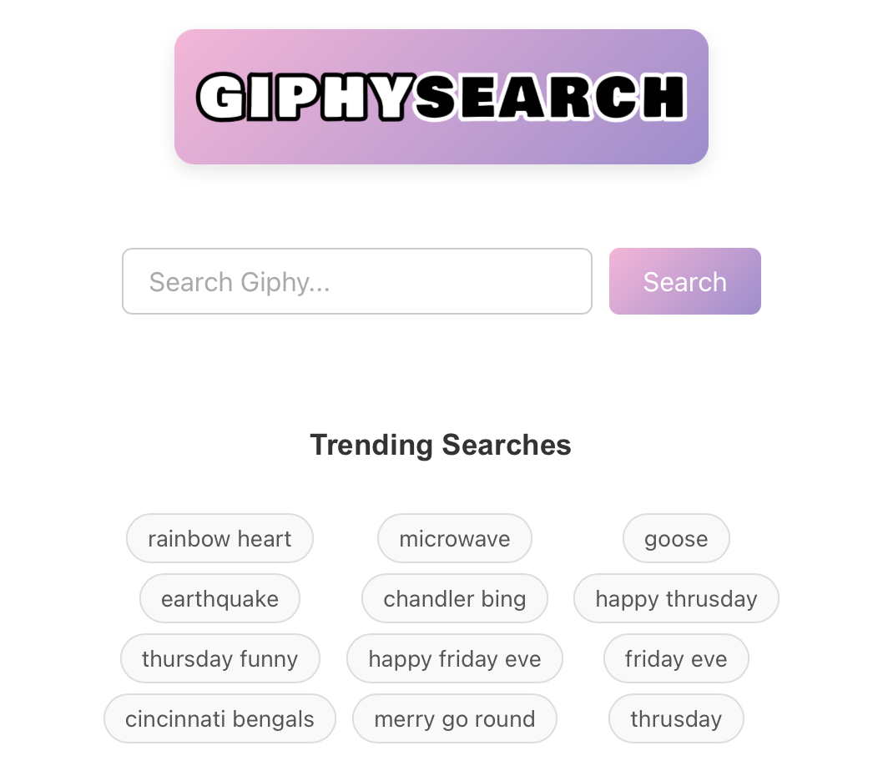

# Giphy Search Project

A simple React site built with [Baseline](https://baselinejs.com/) to search Giphy animations that is deployed to AWS using serverless.

## Features

- Search Giphy for GIFs
- Search the current trending terms
- View animated GIFS
- Copy Links for the GIF or the Giphy page

## UI Example


## Local Requirements

- Node.js 16 [(we suggest using nvm)](https://github.com/nvm-sh/nvm#install--update-script)
- NPM version 7+ [installing npm](https://docs.npmjs.com/downloading-and-installing-node-js-and-npm)
- [AWS CLI v2](https://aws.amazon.com/cli) (only required for local deployment)

## Install
```BASH
git clone https://github.com/AndyMac124/Giphy-Search-Project.git
cd giphy-search-project
npm install
```

## Set up your Giphy API Key for local running

First, ensure your working directory is `giphy-search-project`

```BASH
touch .env
echo "REACT_APP_GIPHY_API_KEY=<YOUR-GIPHY-API-KEY>" >> .env
```

## Run Locally
```BASH
npm start
```

## Baseline

If you would like to learn more about what we do please visit [Baseline](https://baselinejs.com/)

